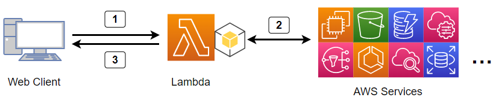

# aws-lambda-describe-api

AWSの参照系API (**describe_xxxx, get_xxxx または list_xxxx**) を HTTP Getメソッドを使ってWebクライアント(通常はWebブラウザー)から実行します。実行結果を中継してWebクライアントに返答します。

AWS Lambda関数のためのPythonプログラムです。

プロキシ(AWS APIプロキシ)のように振舞います。

<br>

## フロー図



1. WebブラウザーでLambda関数のエンドポイントURLへアクセスする
2. URLのパラメータに含まれるAPIがLambda関数で実行される
3. Webブラウザーは結果のJsonを受け取る

<br>

## 実行例

AZ(アベイラビリティゾーン)のリスト

- URL呼び出し

```
https://xxxxxxxxxxxxx.lambda-url.ap-northeast-1.on.aws/?api=ec2:describe_availability_zones&select=ZoneName:ZoneId&indent=4
```

- 応答

```
{
    "AvailabilityZones": [
        {
            "ZoneName": "ap-northeast-1a",
            "ZoneId": "apne1-az4"
        },
        {
            "ZoneName": "ap-northeast-1c",
            "ZoneId": "apne1-az1"
        },
        {
            "ZoneName": "ap-northeast-1d",
            "ZoneId": "apne1-az2"
        }
    ]
}
```

### その他の使用例

[examples.md](examples.md)

<br>

## 通常のAWS API実行と比較した利点

- ページネーションを意識しないでよい (Lambda内で全ページ分を繰り返し取得して1回で全データを返す)
- ```select=項目``` 取得する項目を絞り込む (例は上記)
- ```indent=n``` JSON形式の代わりにHTML形式で表示するオプション
- ```region=us-east-1``` デフォルトリージョンの代わりにリージョン指定のオプション
- S3バケットをキャッシュとして使用する
- ```cache=n``` キャッシュの有効期限を秒で指定
- ```simpletag=Tags``` 複雑なタグ構造をシンプルなタグ構造に変換
- ```flatten``` フラット化オプション  ```ec2:describe_instances``` 専用
- Base64形式のPNG画像文字列を返す ```cloudwatch:get_metric_widget_image``` 専用

## インストール

AWS CloudFormation テンプレートを使用します。

[cfn_lambda-describe-api.yaml](src/cfn_lambda-describe-api.yaml)
