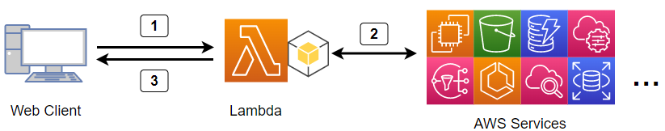

# aws-lambda-describe-api

This program executes AWS read-only APIs (**describe_xxxx, get_xxxx, list_xxxx**) using the HTTP GET method from a web client (typically a web browser).

The execution result is relayed back to the web client.

This is a Python script designed to run as an AWS Lambda function and behaves like a reverse proxy.

## Flow Diagram



1. Access the Lambda function's endpoint URL from a web browser.
2. The API specified in the URL parameters is executed by the Lambda function.
3. The web browser receives the result in JSON format.

## Features

- Execute AWS read-only APIs using HTTP GET:  
Executes APIs such as **describe_xxxx, get_xxxx, list_xxxx** by specifying them in the URL parameters.
- Cache Functionality (S3 Compatible):  
Stores cache in an S3 bucket to enable faster responses on subsequent requests.
- Formatting and Processing of Complex JSON Data:  
  - **select=field**: Filter the fields to retrieve
  - **simpletag**: Simplify complex tag structures
  - **flatten**: Flatten EC2 instance information
- Access Control by IP Address:  
Allows specifying permitted CIDR ranges using the environment variable source_cidr_list.
- Return PNG Image in Base64 Format:  
Dedicated functionality for CloudWatch's **get_metric_widget_image**.

## Environment

- AWS Lambda (Python 3.x)
- Required IAM Policies:
  - ReadOnlyAccess
  - AWSLambdaBasicExecutionRole
  - AmazonS3FullAccess (if using cache)動作環境

## Example Execution

List of Availability Zones

- URL to call from the web client:

```text
https://xxxxxxxx.lambda-url.us-east-1.on.aws/?api=ec2:describe_availability_zones&region=us-east-1&select=ZoneName:ZoneId
```

- 応答

```json
{
  "AvailabilityZones": [
    {
      "ZoneName": "us-east-1a",
      "ZoneId": "use1-az6"
    },
    {
      "ZoneName": "us-east-1b",
      "ZoneId": "use1-az1"
    },
    {
      "ZoneName": "us-east-1c",
      "ZoneId": "use1-az2"
    },
    {
      "ZoneName": "us-east-1d",
      "ZoneId": "use1-az4"
    },
    {
      "ZoneName": "us-east-1e",
      "ZoneId": "use1-az3"
    },
    {
      "ZoneName": "us-east-1f",
      "ZoneId": "use1-az5"
    }
  ]
}
```

### Other Usage Examples

Several usage examples are provided in [examples.md](examples.md)

## AWS Lambda Environment Variables

- ```s3_bucket```  
The name of the S3 bucket used for caching. If not set, caching in S3 is disabled.
- ```default_region```  
The default region for executing APIs. Defaults to ```us-east-1``` if not set.
- ```default_cache```  
Cache duration in seconds. Used to determine the expiration of cache data on S3 (if caching is enabled) and returned as the value for ```Cache-Control: max-age=seconds```. Defaults to ```60``` if not set.
- ```source_cidr_list```  
A list of source IP addresses allowed to access the function, specified in CIDR format. Multiple CIDRs can be specified with spaces. Defaults to ```0.0.0.0/0 ::/0```, allowing access from all IPs. Access from IPs outside the specified range returns HTTP status code **400**.
- ```remove_key_list```  
Removes specific keys and their values from the API response. Multiple keys can be specified with spaces. Defaults to ```ResponseMetadata Marker NextToken nextToken IsTruncated MaxResults``` if not set.

## URL Parameters

- ```api=service:operation```  
Specifies the AWS API to execute. Required.
Example: ```api=ec2:describe_instances```
- ```arg={}```  
Arguments for the AWS API in JSON format. Required or optional depending on the API. ```{``` and ```}``` must be encoded as ```%7b``` and ```%7d```, respectively. For complex arguments like Filters, refer to [examples.md](examples.md).
- ```select=key1:key2```  
Filters the fields to retrieve. Retrieve only the necessary fields. Multiple fields can be specified using  ':' as a separator. This option is effective only when there is a single key name in the data section of the execution result.
Example: ```select=InstanceId:InstanceType```
- ```region=us-east-1```  
Overrides the region specified by the Lambda environment variable ```default_region```.
- ```cache=seconds```  
Override the cache expiration by the Lambda environment variable ```default_cache```. Setting ```cache=never``` disables caching.
- ```simpletag```  
Converts tag information to a simpler structure like ```{"TagKey": "TagValue"}```. No value is required.
- ```flatten```  
Specific to ```ec2:describe_instances```. Removes the Reservations key and flattens the instance information. No value is required.

## Advantages over Traditional AWS API Execution

- Automatic Pagination Handling:  
Retrieves all pages and returns all data in a single response.
- S3 Cache Acceleration:  
Returns cached results for identical requests, reducing API calls.
- JSON Response Formatting and Filtering:  
Extracts only the necessary information from complex JSON data.
- Access for General Users:  
Since the Lambda function executes with its IAM role, it enables a read-only web service for users without AWS IAM accounts.

## Naming Conventions

- For ```api=```, use snake_case. Example: **iam:list_users**
- For key names in select=, use CamelCase. Example: **select=InstanceId**
- In ```arg=``` under Filters, specify the Name using kebab-case. Example: "**Name": "instance-id"**
- The reason for these inconsistent naming conventions is to adhere to Boto3's standards. This avoids introducing bugs by forcibly unifying naming conventions in Lambda functions.

## Limitations

- If the response data size exceeds 5.75 MiB, an HTTP status code **413** error is returned.
- If execution time exceeds 59 seconds, the Lambda function will fail.

## Installation

### AWS CloudFormation Template

With S3 Caching:
[cfn-lambda-describe-api-with-s3.yaml](src/cfn-lambda-describe-api.yaml)

Without S3 Caching:
[cfn-lambda-describe-api.yaml](src/cfn-lambda-describe-api.yaml)

### Notes for Manual Deployment (Without CloudFormation)

- Create an IAM role with the IAM policies mentioned in the Environment section and assign it to the Lambda function.
- Set the Lambda function's timeout to 59 seconds.
- Increase the Lambda function's memory to 256MiB or more as needed.
